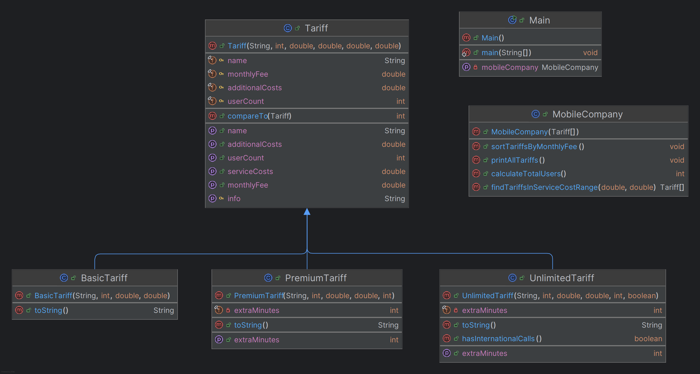

# Лабораторна робота №5 студента групи ІМ-22 Сачка Максима

### Тема:
Наслідування та поліморфізм.

### Мета:
Ознайомлення з механізмом наслідування та принципом поліморфізму. Використання механізму наслідування та принципу поліморфізму в мові Java. Здобуття навичок у використанні механізму наслідування та принципу поліморфізму.

[Умова лабораторної роботи знаходиться тут.](https://docs.google.com/document/d/1r1RhKq2mYwugMr-9FdNiO1Q33UkSzCGTkMJ4L7LrcOo/edit)

Номер студентського квитка: 13879148
- С13 - остача від ділення номера залікової книжки на 13:  
  = 13879148 % 13 = 10 => **Визначити ієрархію тарифів мобільної компанії. Створити список тарифів компанії. Порахувати загальну чисельність клієнтів. Провести сортування тарифів на основі розміру абонентської плати. Знайти тариф у компанії, що відповідає заданому діапазону вартості послуг.**

Для того, щоб запустити програму, необхідно встановити IntelliJ IDEA та Apache Maven. Після чого, перейшовши до кореневої папки проєкту, у терміналі ввести наступні команди у наведеному порядку:
```shell
mvn clean package 
```

```shell
chcp 65001  
```

```shell
java -cp target/lab5-1.0-SNAPSHOT.jar com.sachkomaxim.lab5.Main 
```

Тобто, треба це все писати тут:


UML-діаграма класів:



