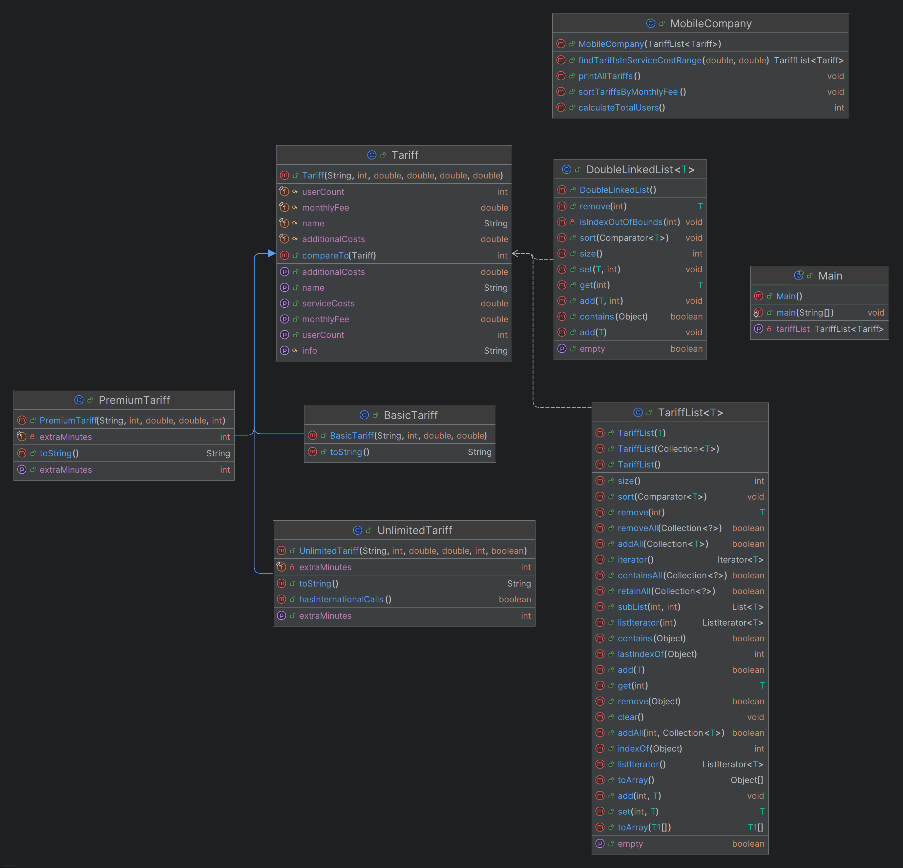

# Лабораторна робота №6 студента групи ІМ-22 Сачка Максима

### Тема:
Робота з колекціями в мові програмування Java.

### Мета:
Здобуття навичок у створенні власних та використанні стандартних колекцій в мові програмування Java.

[Умова лабораторної роботи знаходиться тут.](https://docs.google.com/document/d/1y9EnSWRg70sJh5CBO0N1lmcxFM7SVax2bvfagcH1c2I/edit)

Номер студентського квитка: 13879148
- С2 - остача від ділення номера залікової книжки на 2:  
  = 13879148 % 2 = 0 => **List**

- С3 - остача від ділення номера залікової книжки на 3:  
  = 13879148 % 3 = 2 => **Двозв’язний список**

Для того, щоб запустити програму, необхідно встановити IntelliJ IDEA та Apache Maven. Після чого, перейшовши до кореневої папки проєкту, у терміналі ввести наступні команди у наведеному порядку:
```shell
mvn clean package 
```

```shell
chcp 65001  
```

```shell
java -cp target/lab6-1.0-SNAPSHOT.jar com.sachkomaxim.lab6.Main 
```

Тобто, треба це все писати тут:


UML-діаграма класів:


